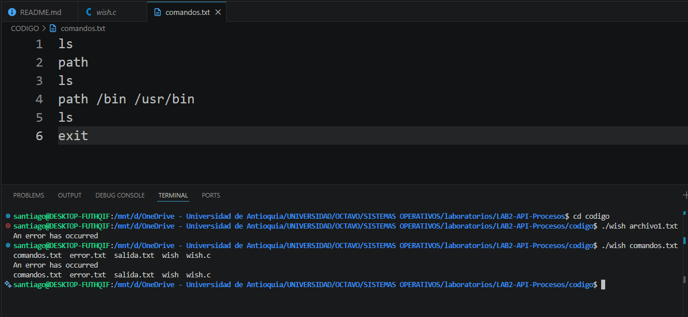
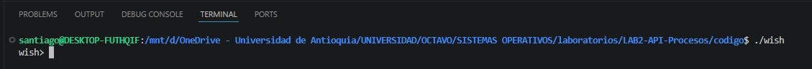
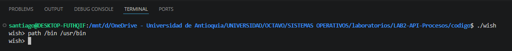
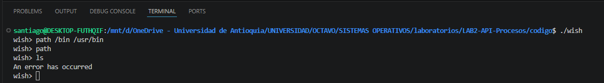
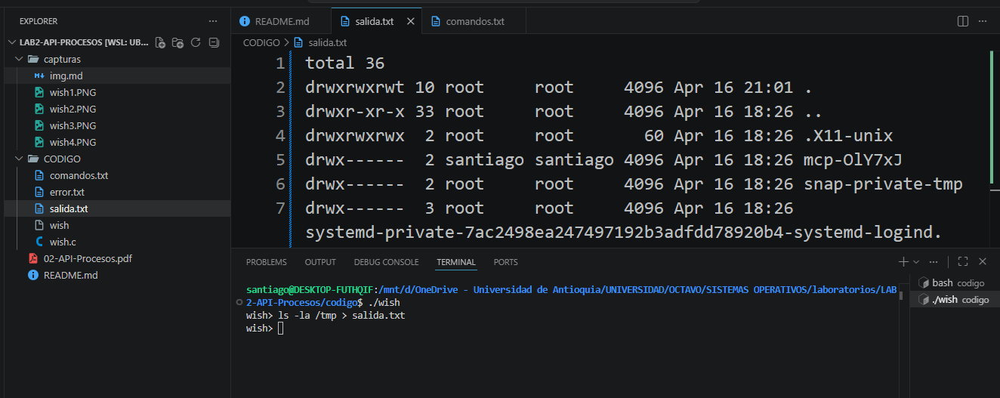
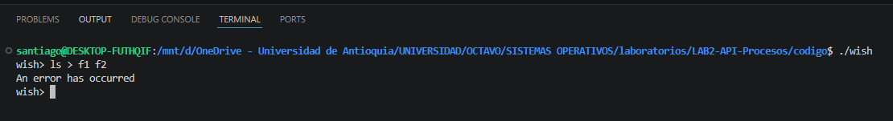
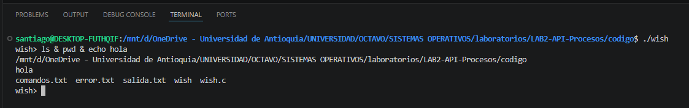
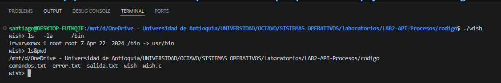

# LAB2-API-Procesos

## Para compilar ejecutar el comando ``gcc -o wish wish.c -Wall``

## (a) Nombres completos de los integrantes, correos y números de documento.

### Santiago Jiménez Escobar - santiago.jimeneze@udea.edu.co - C.C 1036959331
### Emiro Moreno Soto - emiro.morenos@udea.edu.co - C.C 1001547311

## (b) Documentación de todas las funciones desarrolladas en el código.

### **Implementación de shell basico, Path, Built-in commands**
- Funcion  ``print_error()``: Esta función es utilizada para los casos en los cuales el aplicativo genere algún error en ejecución, por lo cual se centraliza con esta función la cual incluye subfunciones como ``write()`` para poder imprimir por la salida de errores el mensaje y ``strlen()`` la cual ayuda a contar la cantidad de caracteres o bytes que tiene el mensaje a mostrar.

- La función ``clear_path()`` es utilizada dentro de la ejecución del código en los casos en que se utiliza el path y es necesario liberar la memoria asociada a los paths guardados en la variable ``search_path``. Esta liberación se realiza en 3 momentos: una cuando el usuario actualiza el path, otra cuando el usuario ejecuta el comando route sin ningún argumento y cuando se finaliza la ejecución con la funcion ``exit()``, en los tres casos se libera esa memoria mediante esta función.

- Con la función ``fopen(argv[1], "r")`` se realiza la apertura del archivo cuando el usuario lo envía después de la ejecución del programa mediante ./wish, antes de esta apertura, se contempló que si el usuario enviaba más de 1 archivo, debía aparecer error, o si en la apertura del archivo no se encontraba en la ruta o estaba vacío, también se salió con error.

- La función ``fflush(stdout)`` permite imprimir en pantalla sin necesidad de esperar que el buffer de memoria esté lleno o que haya un salto de línea; esto se implementó para poder mostrar de manera correcta la leyenda wish> en pantalla y que fuera más interactiva.

- La función ``strcspn(line, "\n")`` se encarga de encontrar en una linea "comando ingresado" el salto de línea "\n", con esto podemos reemplazar ese carácter por un "\0" (carácter nulo), lo cual le indicaría al sistema que es el final de la línea y asi se evitarían errores de ejecucion.

- Con ``strsep()`` es posible delimitar una cadena de caracteres por un carácter en especial; de esta manera se puede segmentar en diferentes partes para una utilización posterior. 

- Mediante ``strcmp()`` permite realizar la implementación de comandos internos como exit, en la cual, por medio de ``strcmp()`` se puede realizar la comparación de dos caracteres; en caso de ser exactamente iguales, devuelve 0, y se ejecuta el código correspondiente. Con esto podemos validar cuándo un usuario ingresa un comando correctamente. 

- Mediante ``strdup()`` la utilizamos para duplicar una cadena, en este caso una copia del path ya que en el siguiente ciclo del shell esta ruta se borrará.

- Con la funcion ``snprintf(buffer, sizeof(buffer), "%s/%s", search_path[i], args[0])`` podemos concatenar las rutas del path con los comandos que se envian por pantalla o por archivo, lo cual me permite utilizar un comando sin necesidad de construir la ruta completa donde se encuentra guardado.

- Implementación de ``access(buffer, X_OK) == 0``, con access se realiza una llamada al sistema para verificar si contamos con los permisos para intentar abrir un archivo, en caso de que no, se ignora esa ruta y se pasaría a la siguiente.

### **Implementación de paralelismo y Redirection**
- Se implementaron los comandos internos cd y path, los cuales permiten respectivamente cambiar el directorio de trabajo actual mediante la función ``chdir()`` y definir las rutas donde el shell buscará los ejecutables.
- Se desarrolló la funcionalidad de ejecución de comandos en paralelo mediante el operador &. Para ello, la línea de entrada se divide utilizando la función ``strsep()``, permitiendo identificar múltiples comandos dentro de una misma instrucción.
- Cada comando separado es procesado de manera independiente, permitiendo la creación de múltiples procesos hijos a través de la función ``fork()``, logrando así la ejecución concurrente de los mismos.
- Para el control de los procesos en ejecución, se implementó un arreglo de identificadores de procesos ``(pid_t pids[])``, en el cual se almacenan los procesos hijos generados.
- Posteriormente, se implementó el uso de la función ``waitpid()`` en un ciclo, permitiendo al proceso padre esperar la finalización de todos los procesos hijos antes de continuar con la ejecución del shell.
- Se incorporó un mejor manejo de la entrada del usuario, considerando espacios en blanco adicionales antes y después de los comandos, lo que garantiza una correcta interpretación de las instrucciones ingresadas.
- Se implementó el manejo del fin de archivo (EOF) en la lectura con ``getline()``, permitiendo finalizar la ejecución del programa de forma controlada mediante exit(0).
- Finalmente, se fortaleció la validación de la redirección de salida (>), asegurando que su uso sea correcto, con un único operador y un solo archivo destino, cumpliendo con los requisitos establecidos.
## (c) Problemas presentados durante el desarrollo de la práctica y sus soluciones.

Uno de los problema tubo que ver en cuando a la estructuracion del proyecto, debido a que en esta oportunidad era un solo aplicativo en funcionamiento, se requeria de una coordinacion mucho mayor para poder realizar la integracion de todas las funcinalidades de una manera adecuada, inicialmente se contemplo una estructura divida en forma de sprint, con epicas y task asignadas, sin embargo debido a que vamos comprendiendo el funcioamiento del codigo sobre la marcha, se volvia una estructura demasiado compleja para seguir, por lo cual se desidio implementar el codigo en dos partes, una consistia en implementar la logica basica de la consola, pasando por el parser y la verificacion de documentos ingresados por aparte y otra en cuando la ejecucion de los comandos y el path, con esto consideramos que se pudo avanzar de una manera mucho mas agil y entendible para todos.

## (d) Pruebas realizadas a los programas que verificaron su funcionalidad.

En la siguiente imagen se observa la ejecución del shell ingresando un archivo en el cual se encuentran los comandos a ejecutar (modo batch)

Continuando, podemos observar la interfaz del shell en la cual se muestra el apuntador de la terminal wish> constantemente, en espera del ingreso de comandos (modo interactivo). 

Después de ingresar en la ejecución del shel, podemos realizar pruebas de comandos de una manera interactiva, por ejemplo, el comando path para asignar una nueva ruta en el directorio de búsqueda.

Después de crear este nuevo path, también se puede probar a eliminarlo y después ejecutar un comando; en este caso debería mostrar el mensaje de error por defecto que fue configurado. 

Otra prueba que podemos realizar es la redirección de un comando para que se guarde en un archivo en específico; en la siguiente imagen se observa la redirección del comando ls hacia el archivo salida.txt

También se prueba la redirección hacia varios archivos; en este caso, como no está contemplado, sale el error genérico. 

En cuanto al paralelismo, probamos la ejecución simultánea de varios comandos; el resultado es que no se ejecutan en orden de colocación, sino más bien en la rapidez con la que el procesador puede ejecutar la instrucción. 

Por último, se logra probar la implementación de validaciones en cuanto al uso de comandos que no tienen una estructura adecuada, por ejemplo, cuando un usuario escribe un comando con muchos espacios; en este caso, el programa omitirá estos espacios y realizará una correcta ejecución.

## (e) Un enlace a un video de 10 minutos donde se sustente el desarrollo.

[Haz clic aquí para ver el video](https://youtu.be/kZarcqfpLcY)

## (f) Manifiesto de transparencia: En que puntos se apoyaron de la IA generativa.
Se solicitó ayuda en la generación de una estructura para trabajar simultáneamente el desarrollo del proyecto, sin embargo, el resultado no fue el esperado debido a que organizar la codificación de un aplicativo tan lineal de esa manera no es tan conveniente con ese tipo de estructura.